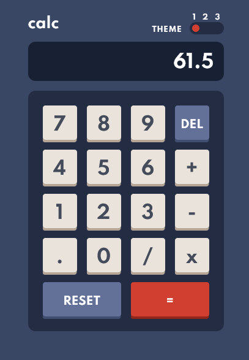

# Frontend Mentor - Stats preview card component solution

This is a solution to the [Calculator app challenge on Frontend Mentor](https://www.frontendmentor.io/challenges/calculator-app-9lteq5N29). Frontend Mentor challenges help you improve your coding skills by building realistic projects. 

## Table of contents

- [Overview](#overview)
  - [The challenge](#the-challenge)
  - [Screenshot](#screenshot)
- [My process](#my-process)
  - [Built with](#built-with)
- [Author](#author)

## Overview

### The challenge

Users should be able to:

- See the size of the elements adjust based on their device's screen size
- Perform mathmatical operations like addition, subtraction, multiplication, and division
- Adjust the color theme based on their preference

### Screenshot

### Links

- Solution URL: [GitHub](https://github.com/sergii-moroz/calculator)

## My process

[YouTube]()

### Built with

- HTML5
- Tailwindcss

## Author

- Website - [YouTube]()
- Frontend Mentor - [link](https://www.frontendmentor.io/profile/sergii-moroz)
